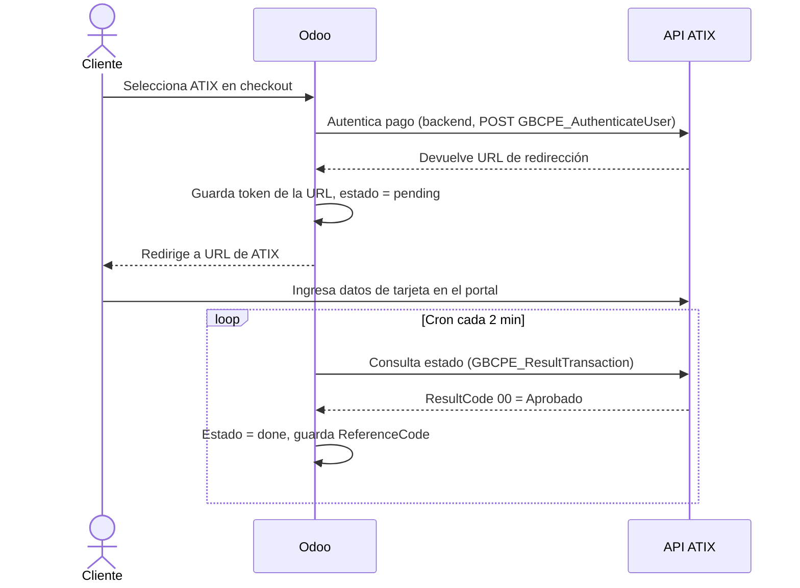

# Proveedor de Pago: ATIX — Documentación Funcional

## Resumen

El módulo `payment_atix` integra Odoo 17 con la **pasarela de pago ATIX** operada por Global Bridge Connections (GBC) para el mercado peruano. Permite que clientes de la tienda en línea (eCommerce) realicen pagos en **Soles (PEN)** y **Dólares (USD)** mediante una redirección segura que conecta con el gateway `gateway.atix.com.pe`.

El módulo sigue el patrón estándar de proveedores de pago de Odoo, extendiendo los modelos `payment.provider` y `payment.transaction`, con un flujo "directo" donde la autenticación ocurre de manera segura en el backend (server-side).

---

## Alcance

**Cubre:**
- Registro y configuración del proveedor ATIX en Odoo
- Procesamiento de pagos desde el eCommerce (website_sale) en PEN y USD con seguridad server-side
- Consulta automática (cron) y manual del estado de las transacciones contra la API de ATIX
- Redirección del cliente al portal de pedido tras el pago exitoso

**No cubre:**
- Pagos desde el backend (ventas manuales)
- Tokenización de tarjetas (guardado de métodos de pago)
- Checkout express
- Múltiples compañías

---

## Dependencias

| Módulo | Razón |
|---|---|
| `payment` | Proveedor base de pagos de Odoo |
| `base_automation` | Para las acciones de servidor automatizadas |
| `website` | Para obtener la URL base del sitio |
| `website_sale` | Integración con el flujo de checkout del eCommerce |

---

## Funcionalidades

### 1. Configuración del Proveedor ATIX

- **Descripción**: Los administradores configuran las credenciales de API para PEN y USD directamente en el formulario del proveedor de pago. Las credenciales están protegidas contra actualizaciones del módulo.
- **Proceso**:
  1. Ir a **Sitio Web > Configuración > Proveedores de pago** (o **Contabilidad > Configuración > Proveedores de pago**)
  2. Abrir o crear el proveedor **ATIX**
  3. Ingresar la **API KEY (PEN)** para transacciones en soles
  4. Ingresar la **API KEY (USD)** para transacciones en dólares
  5. Copiar la **URL de Status** generada automáticamente y registrarla en el panel de ATIX como "Return URL"
- **Resultado esperado**: El proveedor queda activo y listo para procesar pagos desde el checkout

### 2. Procesamiento de Pago (Checkout)

- **Descripción**: Cuando el cliente selecciona ATIX en el checkout, el sistema autentica la transacción en segundo plano y redirige al cliente a la página segura de ATIX para completar el pago.
- **Proceso**:
  1. El cliente llena su carrito y procede al checkout
  2. Selecciona **ATIX** como método de pago
  3. Odoo genera una transacción en estado borrador con los datos del pedido
  4. El servidor de Odoo llama a la API de ATIX de forma segura (sin exponer credenciales al navegador)
  5. ATIX devuelve una **URL de redirección**
  6. Odoo guarda el token de la URL en la transacción (estado: `pending`)
  7. El cliente es redirigido a la URL segura de ATIX para ingresar los datos de su tarjeta
- **Resultado esperado**: La transacción queda en estado `pending` y el cliente completa el pago en el portal del gateway.

### 3. Consulta Automática de Estado (Cron)

- **Descripción**: Cada 2 minutos, el sistema consulta automáticamente el estado de las transacciones pendientes con token asignado y sin código de referencia final.
- **Proceso**:
  1. El cron busca transacciones ATIX con `atix_token` asignado, `atix_reference_code` vacío y creadas en las últimas 6 horas
  2. Para cada una, consulta la API ATIX (`GBCPE_ResultTransaction`)
  3. Si `ResultCode == "00"`: marca la transacción como **completada** (`done`) y guarda el código de referencia
  4. Si `ResultCode == "-99"` y hay código de referencia: marca como **cancelada**
- **Resultado esperado**: Las transacciones se actualizan automáticamente sin intervención manual

### 4. Consulta Manual de Estado

- **Descripción**: Los usuarios pueden forzar una consulta inmediata del estado de una transacción específica.
- **Proceso**:
  1. Ir a **Contabilidad > Pagos > Transacciones de pago** (o **Sitio Web > eCommerce > Pedidos**)
  2. Abrir la transacción ATIX deseada
  3. Usar la **Acción de Servidor** "Consulta estado de pago por pasarela ATIX"
- **Resultado esperado**: El estado de la transacción se actualiza inmediatamente

---

## Flujo de Trabajo Principal

---

## Menús y Navegación

| Función | Ruta de Menú |
|---|---|
| Configurar proveedor | Sitio Web > Configuración > Proveedores de pago |
| Ver transacciones | Contabilidad > Clientes > Transacciones de pago |
| Acción manual de consulta | (en formulario de transacción) Acción > Consulta estado ATIX |

---

## Reportes

No se incluyen reportes específicos en este módulo.

---

## Roles y Permisos

| Rol | Acceso |
|---|---|
| Administrador del sistema (`base.group_system`) | Puede ver y editar las API KEYs de ATIX |
| Usuario de eCommerce (público) | Puede iniciar pagos desde el checkout |
| Contador / Administrador de pagos | Puede ver transacciones y ejecutar consulta manual de estado |
