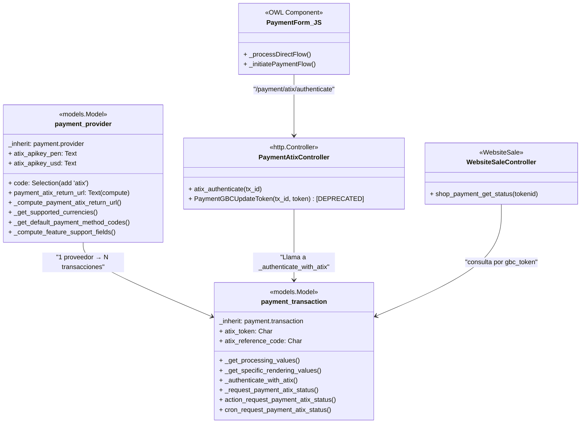

# Proveedor de Pago: ATIX — Documentación Técnica

## Información del Módulo

| Campo | Valor |
|---|---|
| Nombre técnico | `payment_atix` |
| Nombre comercial | Proveedor de pago: ATIX |
| Versión | — (no especificada en el manifiesto) |
| Categoría | `Accounting/Payment Providers` |
| Dependencias | `payment`, `base_automation`, `website`, `website_sale` |
| Post-install hook | `post_init_hook` → `setup_provider(env, 'atix')` |
| Uninstall hook | `uninstall_hook` → `reset_payment_provider(env, 'atix')` |
| Assets frontend | `payment_atix/static/src/js/payment_form.js` |

---

## Arquitectura



---

## Modelos

### `payment.provider` (extendido)

- **Tipo**: `models.Model`
- **Herencia**: `_inherit = "payment.provider"`

#### Campos Agregados

| Campo | Tipo | String | Atributos |
|---|---|---|---|
| `code` | `Selection` | — | `selection_add=[('atix', 'ATIX')]`, `ondelete={'atix': 'set default'}` |
| `atix_apikey_pen` | `Text` | API KEY (PEN) | `required_if_provider="atix"`, `groups="base.group_system"` |
| `atix_apikey_usd` | `Text` | API KEY (USD) | `required_if_provider="atix"`, `groups="base.group_system"` |
| `payment_atix_return_url` | `Text` | URL Status | `compute="_compute_payment_atix_return_url"` |

#### Métodos

- **`_compute_payment_atix_return_url()`**: Genera la URL de callback para registrar en el panel ATIX. Formato: `{base_url}/payment_atix/status/{{{tokenid}}}`. Usa el dominio del `website_id` asociado si existe, o `web.base.url` como fallback.

- **`_get_supported_currencies()`**: Override que filtra las monedas soportadas a `['PEN', 'USD']` cuando el proveedor es ATIX.

- **`_get_default_payment_method_codes()`**: Override que retorna `['gbc']` como método de pago por defecto.

- **`_compute_feature_support_fields()`**: Activa `support_manual_capture='full_only'` y `support_refund='partial'` para proveedores ATIX.

---

### `payment.transaction` (extendido)

- **Tipo**: `models.Model`
- **Herencia**: `_inherit = "payment.transaction"`

#### Campos Agregados

| Campo | Tipo | String | Atributos |
|---|---|---|---|
| `atix_token` | `Char` | ATIX Token | — |
| `atix_reference_code` | `Char` | Reference Code | — |

#### Métodos

- **`_get_processing_values()`**: Override. Añade al dict de valores el `tx_id`. Los datos sensibles de autenticación no se envían al frontend.

- **`_get_specific_rendering_values(processing_values)`**: Override. Retorna un diccionario vacío (`{}`) ya que el flujo de redirección es manejado directamente por el frontend y el backend sin necesidad de un formulario de redirect en QWeb.

- **`_authenticate_with_atix()`**: Llama de forma segura al endpoint `GBCPE_AuthenticateUser` de ATIX desde el servidor. Utiliza un payload `text/plain` conteniendo un JSON con la `Apikey`, la `Version`, y un JSON anidado en el campo `Data` con los datos del pago (`totalamount`, `currency`, `reference`, `email`). Retorna la URL de redirección.

- **`_request_payment_atix_status()`**: Consulta la API `GBCPE_ResultTransaction` de ATIX con el token guardado. Interpreta `ResultCode`:
  - `"00"` → `_set_done()` + `_finalize_post_processing()`
  - `"-99"` + ReferenceCode → `_set_canceled(mensaje)`

- **`action_request_payment_atix_status()`**: Método público que itera `self` y llama `_request_payment_atix_status()`. Usado por la server action.

- **`cron_request_payment_atix_status()`** (`@api.model`): Busca transacciones ATIX con token asignado, sin código de referencia y creadas en las últimas 6 horas, y consulta su estado.

---

## Controladores

### `PaymentAtixController` (`/payment/atix/authenticate`)

- **Ruta**: `/payment/atix/authenticate`
- **Tipo**: JSON, público, POST, sin CSRF
- **Función**: Recibe `tx_id`, busca la transacción, llama a `tx_sudo._authenticate_with_atix()`, extrae el token embebido en la URL retornada, lo guarda en `atix_token` y retorna la `redirect_url` al frontend.

### `PaymentAtixController` (`/payment/atix/update_token`) [DEPRECADO]

- **Ruta**: `/payment/atix/update_token`
- Mantenido temporalmente por compatibilidad con clientes JS cacheados. El flujo actual ya no envía el token desde el frontend, se maneja íntegramente en el backend.

### `WebsiteSaleController` (`/payment_gbc/status/<tokenid>`)

- **Ruta**: `/payment_gbc/status/<tokenid>`
- **Tipo**: HTTP, público, GET, sin CSRF
- **Función**: Busca la transacción por `gbc_token`, llama `_request_payment_gbc_status()` y redirige al portal del pedido.

---

## Frontend (JavaScript)

**Archivo**: `static/src/js/payment_form.js`  
**Framework**: OWL / Odoo JS (`@odoo-module`)

### `PaymentForm.include({...})`

Extiende el formulario de pago estándar de Odoo con dos overrides:

#### `_initiatePaymentFlow(providerCode, paymentOptionId, paymentMethodCode, flow)`
- Si `providerCode !== "atix"`: delega al super.
- Si es ATIX: fuerza el flujo a `"direct"` independientemente del valor original de `flow`.

#### `_processDirectFlow(providerCode, paymentOptionId, paymentMethodCode, processingValues)`
- Llama vía `jsonrpc` a `/payment/atix/authenticate` pasando el `tx_id`.
- Recibe la respuesta del servidor:
  - Si es exitosa, redirige directamente el navegador a la `redirect_url`.
  - Si ocurre un error, lo captura y muestra un cuadro de diálogo nativo de Odoo informando al cliente.

---

## Vistas y Data

### `view_form_payment_provider_atix`
- **Campos visibles** (solo cuando `code == 'atix'`): `atix_apikey_pen`, `atix_apikey_usd`, `payment_atix_return_url`, `support_refund`

### `view_form_payment_transaction_atix`
- **Campos visibles** (solo cuando `provider_code == 'atix'`): `atix_token` (readonly), `atix_reference_code` (readonly)

### `payment_provider_data.xml`
- Carga los datos iniciales del proveedor ATIX. El archivo cuenta con `noupdate="1"` para evitar que las API Keys configuradas en producción se restablezcan con las actualizaciones del módulo.

---

## Datos Precargados

### `payment_provider_atix` (`payment.provider`)
- **Nombre**: ATIX
- **Código**: `atix`
- **API Keys**: valores placeholder `value_pen` / `value_usd` (deben reemplazarse en producción)
- **Método de pago**: `payment.payment_method_card`

### `action_server_request_payment_atix_status` (`ir.actions.server`)
- Ejecuta `record.action_request_payment_atix_status()` en `payment.transaction`

### `cron_action_request_payment_atix_status` (`ir.cron`)
- Intervalo: cada **2 minutos**, sin límite de ejecuciones
- Código: `model.cron_request_payment_atix_status()`

---

## Seguridad

- **`noupdate="1"`**: El archivo XML que carga el proveedor de pagos inicialmente está protegido con `noupdate="1"`. Esto es vital para asegurar que no se sobreescriban las API Keys en caso de actualizar el módulo en el entorno de producción.
- **Server-Side Authentication**: Las credenciales de API Key y detalles de la solicitud de autenticación ocurren estrictamente en el backend.
- Los campos `atix_apikey_pen` y `atix_apikey_usd` están restringidos a `groups="base.group_system"`.

---

## Archivos del Módulo

```
payment_atix/
├── __init__.py                      # Hooks post_init / uninstall
├── __manifest__.py                  # Declaración del módulo
├── const.py                         # Constantes: monedas, métodos de pago, estados
├── controllers/
│   ├── __init__.py
│   └── main.py                      # Controladores HTTP (authenticate, update_token, status)
├── data/
│   ├── action_server.xml            # Server action: consulta manual de estado
│   ├── ir_cron.xml                  # Cron: consulta automática cada 2 min
│   ├── neutralize.sql               # SQL de neutralización (instalación limpia)
│   ├── payment_method_data.xml      # Método de pago ATIX (comentado en manifest)
│   └── payment_provider_data.xml    # Registro inicial del proveedor ATIX (noupdate="1")
├── docs/                            # Documentación técnica y funcional
├── models/
│   ├── __init__.py
│   ├── payment_provider.py          # Extensión de payment.provider
│   └── payment_transaction.py       # Extensión de payment.transaction
├── specs/                           # Especificaciones técnicas (ej. auth server-side)
├── static/
│   ├── description/
│   │   └── banner.png               # Banner para la App Store de Odoo
│   └── src/
│       ├── img/
│       │   └── icon.png             # Icono del proveedor ATIX
│       └── js/
│           └── payment_form.js      # Override frontend del formulario de pago
└── views/
    ├── payment_provider.xml         # Vista form del proveedor (credenciales ATIX)
    ├── payment_transaction.xml      # Vista form de transacción (token/referencia ATIX)
    └── template_payment_form.xml    # Template QWeb (sin uso en el nuevo flujo directo)
```

---

## Endpoints de API ATIX Utilizados

| Endpoint | Método | Uso |
|---|---|---|
| `https://gateway.atix.com.pe/PaymentGatewayJWS/Service1.svc/GBCPE_AuthenticateUser` | POST (JSON) | Autenticación inicial server-side / inicio de sesión de pago |
| `https://gateway.atix.com.pe/PaymentGatewayJWS/Service1.svc/GBCPE_ResultTransaction` | POST (JSON) | Consulta del resultado de la transacción |
