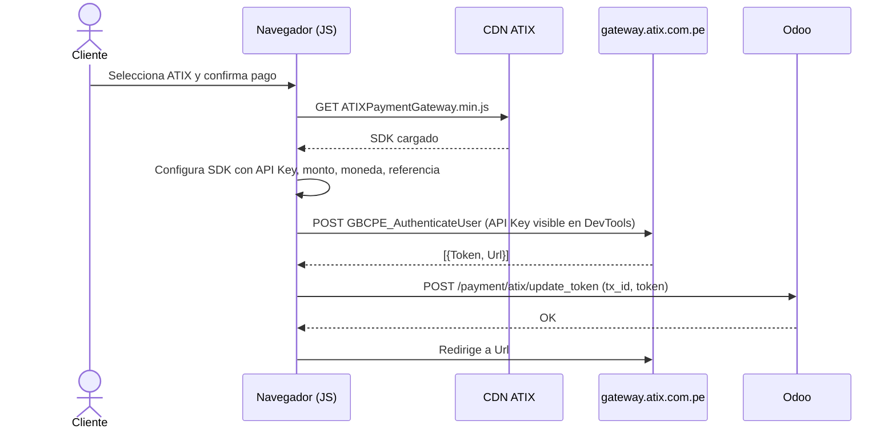
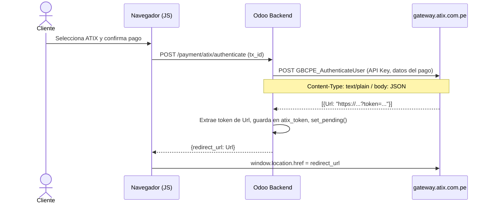

# SPEC-001 — Migración de Autenticación ATIX a Server-Side

| Campo | Valor |
|---|---|
| ID | SPEC-001 |
| Módulo | `payment_atix` |
| Versión Odoo | 18.0 |
| Fecha creación | 2026-05-03 |
| Última actualización | 2026-05-04 |
| Estado | ✅ Implementado y verificado (2026-05-04) |
| Prioridad | Alta |
| Motivación | Observación de seguridad: el endpoint `GBCPE_AuthenticateUser` no debe exponerse al navegador del cliente |
| Documentación oficial | https://docs.atix.com.pe/apis/venta-online.html |

---

## 1. Contexto y Problema

### Flujo Original (reemplazado)

En la implementación original, la autenticación con ATIX ocurría **íntegramente en el navegador del cliente** mediante el SDK `ATIXPaymentGateway.min.js`:



**Problemas de seguridad identificados:**

1. **La API Key queda expuesta en el navegador**: viaja en `processingValues` y es visible en DevTools → Network.
2. **El cliente puede interceptar y modificar el payload** antes de que llegue a ATIX (monto, referencia, etc.).
3. **Dependencia del CDN de terceros**: `ATIXPaymentGateway.min.js` es una dependencia externa no controlada.
4. **`User`/`Password` en el DOM** (renderizado en el template de redirect, visible en el HTML).

---

## 2. Solución Implementada

La llamada a `GBCPE_AuthenticateUser` se mueve al **backend de Odoo**. El navegador solo recibe la `Url` de redirección final.

### Nuevo Flujo



**Beneficios:**
- La API Key **nunca sale del servidor** de Odoo.
- El monto y los datos del pago son tomados del objeto `payment.transaction` en el servidor.
- Se elimina la dependencia del SDK externo `ATIXPaymentGateway.min.js`.
- `User`/`Password` ya no son necesarios en el nuevo protocolo ATIX.

---

## 3. Protocolo de Autenticación ATIX (Documentación Oficial)

> **Fuente**: https://docs.atix.com.pe/apis/venta-online.html

### 3.1 Endpoint

| Entorno | URL |
|---|---|
| Sandbox | `https://gateway.atix.com.pe/PaymentGatewayJWS_Sandbox/Service1.svc/GBCPE_AuthenticateUser` |
| Producción | `https://gateway.atix.com.pe/PaymentGatewayJWS/Service1.svc/GBCPE_AuthenticateUser` |

### 3.2 Request

```
POST <endpoint>
Content-Type: text/plain
```

**Body (JSON serializado como string):**

```json
{
  "Apikey": "TU_API_KEY",
  "Version": "V1.1",
  "Data": "{\"totalamount\":47.0,\"currency\":\"PEN\",\"reference\":\"S01806-1\",\"email\":\"cliente@mail.com\"}"
}
```

> **Nota crítica**: `Data` es un **JSON string** (no un objeto anidado). El valor de `Data` es el resultado de `json.dumps({...})`.

**Parámetros del request:**

| Campo | Tipo | Descripción |
|---|---|---|
| `Apikey` | string | API Key del comercio, específica por moneda |
| `Version` | string | Siempre `"V1.1"` |
| `Data` | string | JSON serializado con los datos de la transacción |

**Campos dentro de `Data`:**

| Campo | Tipo | Requerido | Descripción |
|---|---|---|---|
| `totalamount` | float | ✅ | Monto de la transacción (no como string, como número) |
| `currency` | string | ✅ | Moneda: `"PEN"` o `"USD"` |
| `reference` | string | ✅ | Referencia única por transacción |
| `email` | string | ✅ | Email del tarjetahabiente |
| `expiresIn` | int | ❌ | Segundos de expiración (opcional) |

> **Eliminados del SDK legacy**: `country`, `phone`, `urlorigi`, `mobile`, `typeconection`, `protocol`, `navigator`, `jsondata`, `reference2`, `User`, `Password`. El nuevo protocolo no los requiere.

### 3.3 Response

La respuesta es un **array JSON** con un único elemento:

```json
[
  {
    "Url": "https://gateway.atix.com.pe/PaymentGateway/?token=ABC123..."
  }
]
```

| Campo | Descripción |
|---|---|
| `Url` | URL de pago a la que redirigir al tarjetahabiente. Contiene el token embebido en el query string (`?token=...`) |

> **Cambio vs SDK legacy**: El protocolo anterior retornaba `{Token, Url}` por separado. La nueva API solo retorna `{Url}`, con el token embebido en la URL.

---

## 4. Implementación en Odoo

### 4.1 `models/payment_transaction.py`

#### `_get_processing_values()` — Solo expone `tx_id`

```python
def _get_processing_values(self):
    res = super()._get_processing_values()
    if self.provider_code != 'atix':
        return res
    res.update(tx_id=self.id)  # El único valor que el JS necesita
    return res
```

> **Eliminado**: `atix_apikey`, `partner_email`, `partner_phone`. Estos datos nunca llegan al navegador.

#### `_get_specific_rendering_values()` — Retorna dict vacío

```python
def _get_specific_rendering_values(self, processing_values):
    res = super()._get_specific_rendering_values(processing_values)
    if self.provider_code != 'atix':
        return res
    return {}  # Flujo directo; no se usa template de redirect
```

#### `_authenticate_with_atix()` — Implementación server-side

```python
def _authenticate_with_atix(self):
    """
    Llama al endpoint GBCPE_AuthenticateUser desde el servidor.
    Esquema según documentación oficial: https://docs.atix.com.pe/apis/venta-online.html

    :return: redirect_url (str) — URL a la que redirigir al tarjetahabiente
    :raises UserError: si el gateway retorna un error o no responde
    """
    api_key_map = {
        "PEN": self.provider_id.atix_apikey_pen,
        "USD": self.provider_id.atix_apikey_usd,
    }
    api_key = api_key_map.get(self.currency_id.name) or ""

    # Payload oficial ATIX: Apikey + Version + Data (JSON serializado como string)
    data_dict = {
        "totalamount": self.amount,        # float, no string
        "currency": self.currency_id.name,
        "reference": self.reference,
        "email": self.partner_email or "",
    }
    payload = json.dumps({
        "Apikey": api_key,
        "Version": "V1.1",
        "Data": json.dumps(data_dict),     # Data es JSON string dentro del JSON
    })

    response = requests.post(
        _ATIX_AUTHENTICATE_URL,
        headers={"Content-Type": "text/plain"},
        data=payload,
        timeout=30,
    )

    result = response.json()               # Retorna lista: [{Url: "..."}]
    redirect_url = result[0].get("Url")
    return redirect_url
```

### 4.2 `controllers/main.py`

#### `/payment/atix/authenticate` — Endpoint principal

```python
@http.route("/payment/atix/authenticate", type="json", auth="public",
            methods=["POST"], csrf=False)
def atix_authenticate(self, tx_id, **kwargs):
    tx_sudo = request.env["payment.transaction"].sudo().browse(tx_id)
    redirect_url = tx_sudo._authenticate_with_atix()

    # El token está embebido en la URL: ?token=...
    token = redirect_url.split("token=")[-1] if "token=" in redirect_url else ""
    tx_sudo.write({"atix_token": token})
    tx_sudo._set_pending()

    return {"redirect_url": redirect_url}
```

#### `/payment/atix/update_token` — DEPRECADO

Marcado como obsoleto. Mantener temporalmente para compatibilidad con JS en caché. Eliminar en la siguiente versión.

### 4.3 `static/src/js/payment_form.js`

```javascript
import { rpc } from '@web/core/network/rpc';

_processDirectFlow(providerCode, paymentOptionId, paymentMethodCode, processingValues) {
    if (providerCode !== "atix") {
        return this._super(...arguments);
    }

    return rpc("/payment/atix/authenticate", { tx_id: processingValues.tx_id })
        .then((result) => {
            if (result && result.redirect_url) {
                window.location.href = result.redirect_url;
            } else {
                const errorMsg = (result && result.error) || _t("Error al procesar el pago con ATIX.");
                this._displayErrorDialog(_t("Error de Pago"), errorMsg);
            }
        })
        .catch(() => {
            this._displayErrorDialog(
                _t("Error de Pago"),
                _t("No se pudo conectar con la pasarela de pago. Intente nuevamente.")
            );
        });
}
```

### 4.4 `data/payment_provider_data.xml`

```xml
<odoo noupdate="1">  <!-- noupdate="1" protege las API Keys en producción -->
    <record id="payment_provider_atix" model="payment.provider">
        <field name="atix_apikey_pen">value_pen</field>
        <field name="atix_apikey_usd">value_usd</field>
        <!-- redirect_form_view_id eliminado: flujo directo no usa template de redirect -->
    </record>
</odoo>
```

> **Crítico**: `noupdate="1"` evita que las API Keys configuradas en producción se sobrescriban al ejecutar `-u payment_atix`.

---

## 5. Archivos Modificados

| Archivo | Cambio |
|---|---|
| `models/payment_transaction.py` | ✅ Simplificado `_get_processing_values()`, `_get_specific_rendering_values()`, nuevo `_authenticate_with_atix()` |
| `controllers/main.py` | ✅ Nuevo endpoint `/payment/atix/authenticate`, deprecado `update_token` |
| `static/src/js/payment_form.js` | ✅ Eliminado SDK, reescrito `_processDirectFlow()` |
| `data/payment_provider_data.xml` | ✅ Eliminado `redirect_form_view_id`, agregado `noupdate="1"` |
| `views/payment_provider.xml` | ✅ Eliminado campo `redirect_form_view_id` |

**Sin cambios:**
- `const.py`
- `models/payment_provider.py`
- `views/payment_transaction.xml`
- `data/action_server.xml`
- `data/ir_cron.xml`

---

## 6. Seguridad Post-Implementación

| Aspecto | Estado Anterior | Estado Actual |
|---|---|---|
| API Key expuesta al cliente | ❌ Sí (en `processingValues`) | ✅ No (solo en servidor) |
| `User`/`Password` en el DOM | ❌ Sí (en rendering values) | ✅ Eliminados — no requeridos por nuevo protocolo |
| Monto manipulable por el cliente | ❌ Posible | ✅ No (tomado del servidor) |
| Dependencia de CDN externo | ❌ Sí (`ATIXPaymentGateway.min.js`) | ✅ Eliminada |
| Timeout de requests al gateway | ⚠️ Sin control (SDK) | ✅ 30 segundos explícitos |
| API Keys reseteadas con `-u` | ❌ Sí (sin `noupdate`) | ✅ Protegidas con `noupdate="1"` |

---

## 7. Lecciones Aprendidas — Diagnóstico del Protocolo

Durante la implementación se identificaron varias hipótesis incorrectas sobre el protocolo, que se documentan aquí como referencia:

| Hipótesis | Resultado | Evidencia |
|---|---|---|
| `form-encoded` con `User/Password/Version/Apikey/Data` | ❌ Respuesta `[]` (2 bytes) | HTTP 200 |
| `text/plain` JSON con `Apikey/Email/Phone/Currency/Totalamount/Reference` | ❌ `{all null}` (162 bytes) | HTTP 200 — campos no reconocidos |
| `application/json` con `Data` como objeto anidado | ❌ Bad Request | HTTP 400 — WCF no deserializa objeto en campo string |
| `application/json` con `Data` como JSON string | ❌ Bad Request | HTTP 400 — Content-Type incorrecto |
| **`text/plain` con `Apikey/Version/Data(JSON string)`** | ✅ **`[{Url}]`** | **HTTP 200 — Protocolo oficial** |

> La documentación oficial en https://docs.atix.com.pe/apis/venta-online.html confirma: `Content-Type: text/plain`, body JSON con `Apikey + Version + Data (JSON string)`.

---

## 8. Pruebas

| # | Escenario | Resultado Esperado |
|---|---|---|
| 1 | Cliente paga en PEN con API Key válida | Redirige a ATIX, tx en `pending`, `atix_token` guardado |
| 2 | Cliente paga en USD con API Key válida | Ídem para USD |
| 3 | API Key inválida o vacía | Error visible al usuario, tx no creada en ATIX |
| 4 | Gateway ATIX no disponible (timeout 30s) | Error claro, tx queda en `draft` |
| 5 | Proveedor distinto (no atix) | Flujo normal de Odoo, sin afectación |
| 6 | DevTools → Network | Sin API Keys ni credenciales visibles en requests del navegador |
| 7 | `-u payment_atix` en producción | API Keys no se resetean a `value_pen`/`value_usd` |
